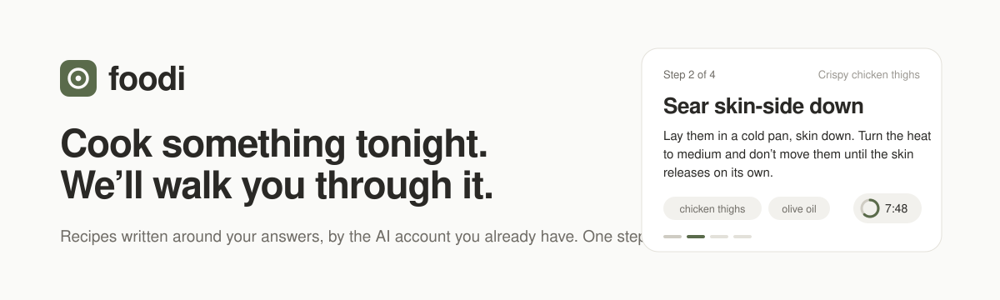
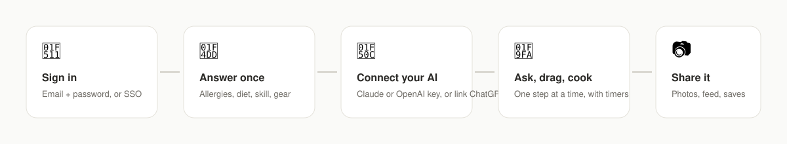
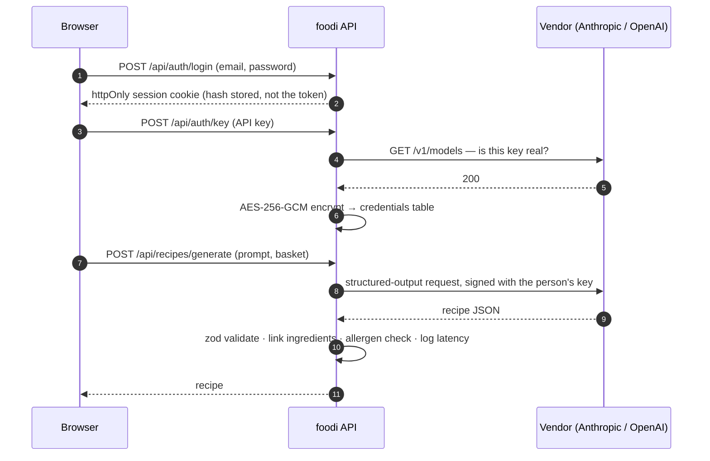

<p align="center">
  
</p>

<p align="center">
  Guided recipes, written around <em>your</em> answers by the AI account you already pay for.<br>
  React 19 · React Router 8 · Express 5 · SQLite · runs on your laptop.
</p>

<br>

## Sixty seconds to a recipe

```bash
git clone https://github.com/danieldvorkin/foodi && cd foodi
npm install
npm run setup      # writes .env with fresh secrets
npm run dev        # web on http://localhost:5100, api on :4100
```

Open **http://localhost:5100**, click **🧪 Mock admin**, and you are cooking with a fake identity provider and a fake chef — no keys, no accounts. When you want real recipes, create an account, then **Connect your AI** (a Claude or OpenAI key, or link ChatGPT).

<p align="center">
  
</p>

## What it does

| | |
|---|---|
| 📝 **Answer once** | Six screens — diet, allergies, dislikes, cuisines, skill, kitchen, time. Every recipe is written against them. Allergens are a hard rule in the prompt, then checked again against the ingredient library after the model answers. |
| 🧺 **Ask, or drag** | Describe what you feel like, or drag from a library of 190+ preset ingredients (with allergens, diet suitability, nutrition, storage, substitutes). Everything in the basket *must* end up in the dish. Save the basket as your pantry. |
| 👣 **Cook mode** | One step at a time, big enough to read from across the counter. Timers start when you tap them and chime when done. "You need" chips per step. Keyboard arrows, screen stays awake, progress survives a refresh. |
| 🎲 **Randomize · ✏️ Adjust** | Same request, a different dish. Or "make it vegan", "halve it", "no oven" — you get a new version, the old one stays. |
| ✍️ **Write your own** | A recipe editor with the same drag-and-drop ingredient library, step timers, temperatures, tips. |
| 📣 **Feed** | The front page: a three-column feed with a composer, shortcuts and your latest recipes on the left, people to follow and fresh blog posts on the right. Filter to *Everyone* or *Following*. Photos and short videos on recipes and posts; likes and comments. |
| 👥 **Follow people** | Follow from a profile, the feed or a blog post. Follower / following counts and lists on every profile; new posts from people you follow land in your notifications. |
| 📓 **Blog** | Longer writing with light markdown (headings, lists, bold, links), a cover photo, a gallery, and up to six attached recipes. Drafts stay private; published posts join the feed. Likes and comments. |
| 📚 **Recipe books** | Curated, ordered collections on your profile — yours or anyone's shared recipes, with a note per recipe and drag-to-reorder. Public or private. "Add to book" lives on every recipe page. |
| 🍴 **Adapt a recipe** | Copy any shared recipe into an editable version of your own, write down what you changed, and share it — the original and its author are credited on the recipe page and in the feed, even if the original is later deleted. |
| 🍳 **House kitchen** | 58 tested starter recipes from `@foodi` across 20+ cuisines, every meal type and the main dietary needs (vegan, gluten-free, dairy-free, nut-free, keto, halal, kosher…), organised into six curated books. Seeded on first boot; one is shared to the feed a couple of times a day (rate in Admin → Settings). Like, save, shelve or adapt them — comments are off. |
| 📱 **Phone & tablet** | Bottom tab bar on phones with a raised Create button and a "Me" sheet; two-column feed on iPad portrait; bottom sheets, safe-area insets, 16px inputs so iOS doesn't zoom. |
| 💵 **Sell recipe books** | Put a book of your own recipes up for sale ($0.99–$499), with a pitch and a free preview. Buyers get the whole book forever — cook mode, adapting, shelving. foodi keeps a configurable cut (20% by default); sellers request payouts from **Sales & payouts**. |
| 🚀 **Promote a book** | Three packages (3 / 7 / 30 days) put a book into everyone's feed as a clearly labelled *Promoted* card and into the *Featured books* rail, with impressions and clicks tracked. |
| 🛠 **Commerce portal** | Admin → Sales & payouts: revenue, every purchase (refund with access revoked), every promotion (stop), payout requests (mark paid / decline with a note), fee and on/off switches. |
| 💳 **Stripe or test mode** | Stripe Checkout with signed webhooks when `STRIPE_SECRET_KEY` is set; otherwise a loud in-app test checkout so the whole flow works locally with no money moving. |
| 🔔 **Notifications** | Likes, comments, saves, follows, adaptations, books, posts from people you follow, role changes and admin notices. Pushed live over Server-Sent Events (polling fallback), with a bell dropdown and a full page. |
| 🛠 **Admin** | Overview with a 14-day generation chart, people (roles, disable, revoke sessions), recipe and post moderation, photo moderation, generation logs with latency and tokens, runtime settings, an append-only audit log. |

## Sign-in and the AI credential are two different things

You **sign in** with email + password (scrypt-hashed) or an SSO provider. You **connect an AI** separately, from Settings, and can swap or disconnect it any time. foodi never bills anyone for generation — the connected account does the writing.



**Claude.** Anthropic does not permit third-party apps to offer Claude.ai sign-in or to store Claude.ai tokens ([their words](https://code.claude.com/docs/en/legal-and-compliance)), so Claude connects with a Console API key. The generic OIDC client (`server/src/auth/providers/oidc.ts`) is ready the day a sanctioned flow exists — it is config, not code.

**OpenAI.** Set `OPENAI_OAUTH_CLIENT_ID` and "Link ChatGPT" appears. After sign-in, foodi tries the RFC 8693 token exchange for an API key; if the account can't do that, it says so and you can paste a key instead.

**Mock.** In development, an in-process OpenID Connect provider (`/mock-oauth`) runs the *real* OAuth code path — discovery, PKCE S256, `state`, `nonce`, RS256 id_token verified against its JWKS — with four pretend people and an offline chef that still respects allergies, diet and the basket. It is compiled out in production.

## Deploying

`docs/DEPLOY.md` walks through Fly.io: one machine, one volume, `fly deploy --remote-only`, secrets, and making yourself admin with `node dist/make-admin.js`. The `Dockerfile` builds all three workspaces and runs as an unprivileged user.

## Where your data lives

Everything stays on the machine running the server.

| What | Where | How |
|---|---|---|
| People, recipes, posts, blog, books, follows, notifications, settings, audit log | `server/data/foodi.db` (SQLite, WAL) | Plain rows. Delete the file to start over. |
| API keys and OAuth tokens | same DB, `credentials` table | AES-256-GCM with the key in `.env`. Only the last four characters of a key are kept in the clear, so Settings can show which key is connected. The DB alone is useless without the `.env` key. |
| Passwords | `passwords` table | scrypt (N=2¹⁷, r=8, p=1), 16-byte salt, constant-time compare. |
| Sessions | `sessions` table | Only the SHA-256 of the cookie value is stored. |
| Photos and videos | `server/data/uploads/` | Random file names; JPEG/PNG metadata (EXIF, GPS, text chunks) stripped on upload. |
| Secrets | `.env` | Generated by `npm run setup`. Git-ignored. |

The only outbound traffic is the recipe request to the vendor you connected, and the one `GET /v1/models` used to check a key.

## Architecture

```
foodi/
├── shared/    zod schemas + the ingredient library — one source of truth for server and client
├── server/    Express 5 · node:sqlite · no ORM, no native deps
│   └── src/
│       ├── auth/        OIDC+PKCE client, password login, hashed sessions, encrypted credentials
│       ├── ai/          prompt · JSON schema · Anthropic (tool use) · OpenAI (strict schema) · offline mock
│       ├── routes/      profile · recipes · social (feed, follows) · blog · books · notifications (SSE) · media · admin
│       ├── middleware/  requireAuth · requireRole · CSRF origin check · errors
│       └── mock/        dev-only OpenID Connect provider
└── client/    Vite · React 19 · React Router 8 (data mode) · @dnd-kit · plain CSS with tokens
    └── src/routes/      landing · onboarding · connect · app/* (feed · cook · blog · books · profiles · settings) · cook/:id · admin/*
```

Generation is a small vendor interface (`server/src/ai/types.ts`). Each adapter asks for a schema-shaped answer — Anthropic via forced tool use, OpenAI via strict `json_schema` — and everything is validated with the same zod schema the client renders from.

## Security notes

Built to a staff-engineer bar, reviewed with a security pass; the full list lives in the code, the headlines are here.

- **Sessions**: opaque 256-bit tokens, `httpOnly` `SameSite=Lax` cookies, `Secure` in production, hashed at rest, sliding expiry, "sign out everywhere".
- **CSRF**: every state-changing request must carry our `Origin` (or `Sec-Fetch-Site: same-origin`); JSON-only body parsing.
- **OAuth**: state and PKCE verifier live in an encrypted, 10-minute cookie; `state` compared in constant time; id_token issuer/audience/nonce verified; `returnTo` restricted to same-app paths.
- **RBAC**: `admin` / `consumer`, enforced server-side on every `/api/admin` route; you cannot demote or disable yourself; the last admin cannot be removed; every admin action is audited. Admin-by-email only applies to identities whose provider verified the address; first-registrant bootstrap is development-only and hard-off in production.
- **Uploads**: real type sniffed from magic bytes (declared type ignored), size and per-person quota, metadata scrubbed, served with `nosniff` and access checks that follow recipe/post visibility.
- **Inputs**: zod on every body, param and query; SQL always parameterised; helmet CSP with `script-src 'self'`.
- **Logs**: pino with redaction of keys, tokens and cookies.
- **Passwords**: scrypt, generic failure message with equal timing for unknown emails, small denylist, rehash on parameter changes.

Known gaps, on purpose for a local-first v1: no email verification or password reset (there is no mail server), WebP/video metadata is not stripped, no image thumbnails (originals served with `object-fit`).

## Configuration

Everything is in `.env.example`, with defaults for local development.

| Variable | Default | Notes |
|---|---|---|
| `FOODI_SESSION_SECRET` | *(generated)* | ≥ 32 chars. HMACs identities from keys. |
| `FOODI_ENCRYPTION_KEY` | *(generated)* | 32 bytes hex. Encrypts credentials at rest. Losing it means everyone reconnects their AI. |
| `FOODI_APP_ORIGIN` / `FOODI_API_ORIGIN` | `:5100` / `:4100` | Vite proxies `/api` to the API in dev. In production the API serves `client/dist`. |
| `FOODI_ENABLE_MOCK_PROVIDER` | `true` outside production | Mock IdP + mock chef. Forced off in production. |
| `FOODI_BOOTSTRAP_FIRST_ADMIN` | `true` outside production | First account becomes admin. |
| `FOODI_ADMIN_EMAILS` | — | Comma-separated; promoted on every sign-in. Or `npm run make-admin -- <email\|handle>`. |
| `ANTHROPIC_MODEL` / `OPENAI_MODEL` | `claude-sonnet-5` / `gpt-5` | |
| `OPENAI_OAUTH_CLIENT_ID` … | — | Enables "Link ChatGPT". Redirect URI: `${FOODI_API_ORIGIN}/api/auth/openai/callback`. |
| `GENERIC_OAUTH_*` | — | Any OIDC provider, for a future sanctioned Claude flow or your own IdP. |

## Scripts

```bash
npm run dev          # both servers with hot reload
npm run check        # typecheck + tests + production builds
npm test             # server integration tests (auth, RBAC, CSRF, media, social)
npm run build        # esbuild bundle for the API, Vite build for the client
npm start            # production: node server/dist/index.js serves API + client
npm run make-admin -- you@example.com
```

## Design

Neutral and low-glare on purpose: near-white and charcoal grounds, one sage accent reserved for things you can do or that are happening, muted red only for allergen warnings, a single variable typeface (Bricolage Grotesque, self-hosted). Light and dark follow the system. The notes — including what was tried and rejected — are in [`docs/DESIGN.md`](docs/DESIGN.md).

## License

MIT — see [`LICENSE`](LICENSE).
